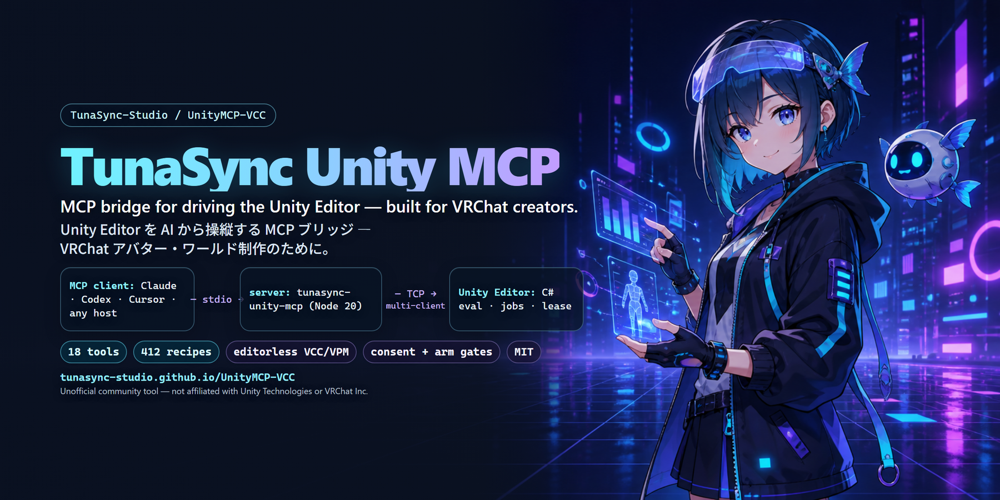

# TunaSync Unity MCP (v2)

[English README is here / 英語版 README](README.md)



Unity Editor を AI から操縦する MCP ブリッジ — VRChat のアバター・ワールド制作のために作られています。
2026-08 に全面書き直し (v2)。旧 426 ツール構成のフォーク系譜は開発リポジトリの
`legacy-v1` ブランチにあり、このリリースには含まれません。

> 非公式のコミュニティツールです。VRChat 社・Unity 社とは無関係です。

## クイックスタート

**1 — Unity 側 (VCC):** このリポジトリを追加して ([ワンクリック追加ページ](https://tunasync-studio.github.io/UnityMCP-VCC/))、**TunaSync Unity MCP** をプロジェクトに導入:

```
https://tunasync-studio.github.io/UnityMCP-VCC/vpm/index.json
```

**2 — AI 側 (MCP クライアント・Node 20+):**

```bash
# Claude Code
claude mcp add unity-mcp -- npx -y tunasync-unity-mcp

# OpenAI Codex CLI
codex mcp add unity-mcp -- npx -y tunasync-unity-mcp
```

**3 —** プロジェクトを開いて初回の同意ダイアログを承認 (`Tools > TunaSync Unity MCP > Creator Console`)、AI に `unity_health_check` を頼んで接続を確認。

MCPセッション不要のローカル診断:

```bash
npx -y tunasync-unity-mcp doctor
```

詳細 (UPM 経路・手動 MCP 設定・実アップロードの arm): `docs/INSTALL.ja.md`。

## アーキテクチャ

```
MCP クライアント (Claude, Codex, Cursor など任意の MCP ホスト - N セッション)
   │  stdio
   ▼
server/  tunasync-unity-mcp (Node 20+, MCP SDK 1.x, esbuild 単一バンドル)
   │  TCP 127.0.0.1:<port>, uint32-BE 長さ接頭辞付き JSON エンベロープ
   │  相関ID, tombstone, 再接続ステートマシン, 進捗ブリッジ
   ▼
package/com.tunasync.unity-mcp  (Editor 専用 VPM/UPM パッケージ)
   プロジェクトごとに TcpListener: port = 47700 + fnv1a32(projectPath) % 64
   ディスカバリレジストリ: %LOCALAPPDATA%\UnityMCP\registry\<hash8>.json
   MainThreadPump / CompileGate / JobManager / LeaseManager / LogCapture
   eval = Unity 同梱の Roslyn (DotNetSdkRoslyn csc.dll, プロセス外実行,
   実効 C#10 - 同梱 DLL ゼロ)
```

- **プラグイン側がリスナー** → MCP クライアントは何本でも同時接続可能。
  ポートの取り合いもゴーストソケットもありません。(2026-08-07 実測:
  1 プラグインに 3 クライアント同時・2 エディタ並行操縦・リースの相互奪取・
  片方を 140 秒フリーズさせても他方は無傷)
- ドメインリロード儀式: 実行中リクエストには `DOMAIN_RELOAD` (retryable)、
  クライアントには `bye`、リロード後に同じポートへ再バインド。コンパイル診断は
  SessionState 経由で生存 (`sys.compile.status`)。
- 長時間処理 (NDMF ベイク・VRC アップロード・ビルド) はジョブとして実行され、
  進捗ストリームとリロード耐性を持ちます。
- 複数セッションの書き込みは自動取得リースで直列化 (TTL 120 秒・takeover 可・
  切断ホルダーは奪取可能)。
- キルスイッチ: プロジェクト直下に `UnityMCP.disabled` を置く
  (メニュー: Tools > TunaSync Unity MCP > Toggle Disabled Marker)。

## ツール面 (18)

`execute_editor_command` (C# eval・長い処理は `run_as_job`)、
`get_editor_state` (セクション指定+`max_bytes` ガード)、`scene_query`、
`get_logs`、`camera_capture`、`unity_health_check` (+wake)、`session_lease`、
`job_status`、`job_cancel`、`find_recipe`、`ndmf_bake_run`、`vrc_upload`
(avatar/world・`dry_run`=アップロード前検査)、`vrc_avatar_audit`。

さらに **Unity Editor の起動が不要な VCC/VPM ペア** (v2.4.x):
`vcc_project` (VCC が知っているプロジェクトの一覧 / 1 プロジェクトの
ロック済み VPM パッケージ読み取り — 純粋なファイル読みのみ) と
`vpm_manage` (add / remove / resolve / outdated / repo 一覧、そして
**`create`** — VCC テンプレートから新規プロジェクトを丸ごと構築し、
resolve と追加パッケージ導入まで Unity 起動前に済ませる — を
オープンソースの [vrc-get](https://github.com/vrc-get/vrc-get) CLI 経由で実行。
vrc-get が PATH に無い場合はインストール案内を返し、`vcc_project` はそのまま
動き続けます)。「MA 入りの新しいアバタープロジェクト作って」が Unity を
開く前に完了します。変更系は配信モードでは他の破壊系ツールと同様ロックされます。

v2.6.0 でさらに3本: `unity_editor` (エディタプロセスの launch / quit /
status — Unity.exe は VCC 設定か Hub から解決・`-projectPath` 起動のみ・
quit は graceful 優先)、`asset_import` (`.unitypackage` の一級インポート・
常に非対話・取込アセット一覧を返す)、`vrc_menu` (メニューの `tree` /
`audit` — パラメータのレイヤーが animate する Transform の実在まで検査して
「死にメニュー」を炙り出します)。

旧 426 ツールの機能はすべて 400 本超の **レシピ** (`recipes/`) として保存されています:
markdown 内のフェンス付き C# ブロックを `execute_editor_command` の `code` に
そのまま貼れます (markdown ファイル全体ではなくコードブロックを貼ること) —
eval 層が素の文スニペットを `class EditorCommand { static object Execute() }`
契約に自動ラップし、各レシピの `// requires-using:` ヘッダを解釈し、
未束縛の `args` を読むボディには空の `args` JObject を自動供給します
(plugin 2.3.7+。`args` は C# ソース内の変数であってツールパラメータではありません)。
パラメータ付きレシピをスタブのまま実行するとレシピ自身が `"<field> required"`
エラーを返すので、ソース内のスタブ行を実値入りの
`var args = JObject.Parse("{...}");` に置き換えてください。
`find_recipe` は旧ツール名の完全一致+キーワード検索に対応し、レシピは
MCP リソース (`recipe://<category>/<name>`) としても公開されます。

## インストール前に — できること・状態・AI に何を許すことになるか

- **これは何か**: AI アシスタントに **Unity Editor 内で任意の C# を実行させる**
  MCP ブリッジです (それが `execute_editor_command` とレシピ群の本質です)。
  エディタスクリプトのコンソールを人に渡すのと同じと考えてください。
  エディタスクリプトにできること — アセットの変更・削除・ビルド実行 — は
  すべて到達可能です。変更されてもよいプロジェクトでのみ有効化し、必ず
  バージョン管理下に置き、AI が信頼できないコンテンツ (Web ページ・
  インポートしたファイル) から読んだ指示に影響され得ることを意識してください。
- **同意+認証**: そのプロジェクトで有効化するまで何もリッスンしません
  (初回のみのダイアログ)。ソケットはループバック専用で、クライアントは
  あなたの OS ユーザーしか読めないトークンの提示が必要です。
- **プラットフォーム**: 現状 **Windows のみ**。同意/レジストリのパスが
  `%LOCALAPPDATA%` を使い、eval エンジンが Unity 同梱の
  `Editor/Data/NetCoreRuntime/dotnet.exe` を起動します。macOS/Linux は未検証。
- **Unity**: **2022.3.22f1** (VRChat のバージョン) で検証済み。他の 2022.3
  パッチは動くはずです。Unity 6 / 他メジャーは未検証 — eval ツールチェーンの
  プローブは大声で失敗し、`eval.run` は誤動作せず `EVAL_ENGINE_UNAVAILABLE`
  を返します。
- **`vrc_upload`**: `dry_run:true` (検証) と実アバター公開経路は実プロジェクトで
  実射検証済み (2026-08-06)。ワールドの `dry_run` 経路は公開済みワールドで
  実射検証済み (2026-08-07)。v2.2.0 以降、実アップロードは二重ゲートです:
  `confirm:true` (呼び出し側の意思) **と** 人間が作る一回限りの arm ファイル
  (TTL 30 分・試行ごとに消費) の両方が必要 — 指示に従う AI が無人で公開する
  ことはありません。リポジトリのチェックアウト無しで arm する方法:
  `docs/INSTALL.md` の「Arming a real VRChat upload」参照。
- **配信モード**: `UNITY_MCP_STREAM_MODE=1` で破壊系・公開系ツールをロックし、
  全出力のユーザーパスをマスクします (画面共有セッション用) —
  `docs/STREAMING.md`。
- **NDMF ベイク** は `Assets/UnityMCP_Bakes/` 配下にベイク済みプレハブを書き、
  元のアバターには触れません。

## 既知の問題

- `vrc_avatar_audit` の `textureMegabytes` はレンダラーから到達できる
  テクスチャのみを数えます。アニメーションクリップやビルド時生成
  (Modular Avatar の差し替え等) からのみ参照されるテクスチャは含まれません —
  実測した 1 体では実合計の約 8% が見えていませんでした。上限付近では
  下限値として扱ってください。
- Unity 6 は未検証です (VRChat は現在 2022.3。eval ツールチェーンのプローブは
  誤動作せず明示的に失敗します)。
- 一部レシピの front matter は `params:` の宣言が不足しています。eval 層が
  空の `args` をスタブするのでレシピは動作し、必要なフィールドを自己申告します
  (上のレシピ段落参照)。

## インストール

最短: MCP コマンドに `npx -y tunasync-unity-mcp`、Unity 側に VCC/UPM
パッケージ — 詳細は `docs/INSTALL.ja.md` (日本語) / `docs/INSTALL.md` (英語)。
ソースから (パスはすべてリポジトリルート基準):

```bash
npm --prefix server install && npm --prefix server run build
```

MCP クライアントへの登録 (stdio): `node <repo>/server/build/index.js`。

Unity プロジェクトへのプラグイン導入 — 1 行・フォルダコピー無し:

```bash
powershell -ExecutionPolicy Bypass -File tools/install-to-project.ps1 -ProjectPath "C:\path\to\YourProject"
```

(UPM の `file:` 参照を 1 行追加するだけです)。VRC SDK / NDMF 連携は該当パッケージが
あるとき asmdef の versionDefines で自動的に有効化されます。素の Unity
プロジェクトでも動作します。

## 開発

- プロトコル契約: `docs/PROTOCOL.md` = `server/src/protocol.ts` =
  `package/.../Editor/Core/Protocol.cs` (3 つ全部変えるか、どれも変えないか)。
- テスト: `cd server && npm test` (vitest・モックプラグイン・Unity 不要)。
- ライブゲート: `tools/smoke-p1.mjs` (トランスポート)、`tools/smoke-p2.mjs`
  (eval/ジョブ/リロード)、`tools/smoke-p3-mcp.mjs` (MCP フルチェーン)。

## ライセンス

v2 のコード (server/, package/, recipes/, tools/, docs/): MIT, (c) TunaSync
(`LICENSE` 参照)。開発リポジトリの `legacy-v1` ブランチには上流フォークの系譜
([swax/UnityMCP-VRC](https://github.com/swax/UnityMCP-VRC), CC BY-NC 4.0) が
ありますが、v2 はそのコードを一切含まず、このリリースツリーにも当該ブランチは
含まれません。
